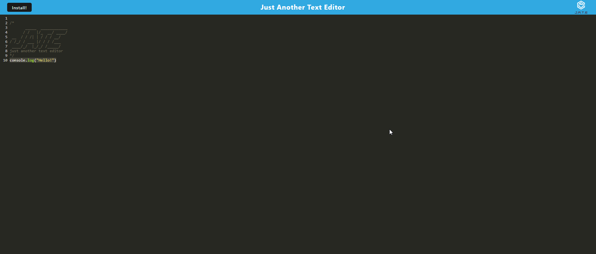

# J.A.T.E.


## Description

This is a text editor (Just Another Text Editor) built with Node, Express.js, Webpack config and indexdb. Additionally, it offers syntax highlighting via Code Mirror. It is a fully functional progressive web app and can be downloaded or easily used offline.



[Deployed Application](https://jatebycait.herokuapp.com/)

## Table of Contents

- [Installation](#installation)
- [Usage](#usage)
- [License](#license)
- [How to Contribute](#contributing)

## Installation

To install necessary dependencies, use the following command:

```
npm i
```

## Usage

Once you have the files, just enter npm run start on the command line to start up the app. If you would like to install the PWA, click on the install button.

## License

[MIT](https://choosealicense.com/licenses/mit/)

## Contributing

I'd happily welcome any contributions, please feel free to do so as you have time and energy to do so.

## Questions

If you have any questions, please open an issue or reach out to me via email at <caitlin.coy.roberts@gmail.com>. You can find more of my work at [ccroberts1](https://github.com/ccroberts1)
